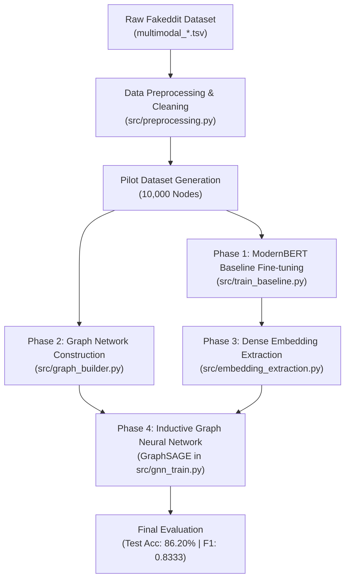

# Multimodal & Graph-Enhanced Fake News Detection (FND)
## Complete Methodology, Pipeline Architecture & Experimental Report

---

### Executive Summary

In online social platforms (such as Reddit), deceptive content and fake news rarely exist in a linguistic vacuum. Conventional detection systems rely exclusively on textual indicators (sentiment, vocabulary, stylometry), which can easily be bypassed or mimic authentic news writing. 

This project explores a **hybrid architecture** combining **state-of-the-art Transformer language models (ModernBERT)** with **Graph Neural Networks (GraphSAGE / GATv2)**. By integrating semantic textual signals with social relational context (shared authors and linked submissions), the system significantly enhances detection accuracy over text-only baselines.

---

### Pipeline Architecture Overview



---

### 1. Data Processing & Dataset Statistics

The project uses the **Fakeddit** multimodal dataset benchmark consisting of Reddit posts with text, metadata, and classification labels.

#### Dataset Partitions (Pilot Configuration)
* **Training Set:** 8,000 posts (80%)
* **Validation Set:** 1,000 posts (10%)
* **Testing Set:** 1,000 posts (10%) — **Kept completely unseen until final evaluation**
* **Total Records:** 10,000 samples

#### Preprocessing Steps (`src/preprocessing.py`)
1. **Feature Pruning:** Selected high-signal attributes: `id`, `author`, `subreddit`, `linked_submission_id`, `clean_title`, `created_utc`, and `label` (`2_way_label`).
2. **Missing Value Imputation:**
   * Missing authors imputed as `"unknown_author"`.
   * Missing subreddits imputed as `"unknown_subreddit"`.
   * Unlinked posts assigned an empty string `""`.
3. **Cleaning & Filtering:** Stripped null, whitespace-only, or degenerate text rows to eliminate noise.

---

### 2. Methodologies & Modeling Phases

#### Phase 1: Semantic Representation via ModernBERT Baseline
* **Model:** `answerdotai/ModernBERT-base` (Encoder Transformer, 2024 SOTA architecture)
* **Key Innovations:**
  * Uses Rotary Positional Embeddings (**RoPE**) and **FlashAttention-2** optimizations.
  * Native context window up to **8,192 tokens**.
  * Superior processing throughput compared to legacy BERT or DeBERTa architectures.
* **Training Objective:** Binary Cross-Entropy with AdamW optimizer and linear warmup schedule.
* **Role in System:** Fine-tuned directly on post titles to provide text-only baseline predictions and capture deep contextual linguistic representations.

---

#### Phase 2: Relational Graph Construction (`src/graph_builder.py`)
Rather than treating each post as an isolated sample, posts are mapped into a unified homogeneous graph $\mathcal{G} = (\mathcal{V}, \mathcal{E})$:

1. **Nodes ($\mathcal{V}$):** 10,000 nodes representing distinct Reddit posts.
2. **Edges ($\mathcal{E}$):** 9,878 bidirectional/directed edges constructed through:
   * **Explicit Linkages:** Direct post-to-post references via `linked_submission_id` ($52 \times 2 = 104$ directed edges).
   * **Co-Authorship Communities:** Posts authored by the same user are connected via clique subgraphs ($9,828$ directed edges). Author cliques with $>50$ posts are pruned to prevent out-of-memory degree explosion from bot accounts.

---

#### Phase 3: Text Representation to Node Feature Matrix ($\mathbf{X}$)
* Each node $v_i \in \mathcal{V}$ receives a feature vector $\mathbf{x}_i \in \mathbb{R}^{768}$ derived from the `[CLS]` / pooled output of our fine-tuned ModernBERT model (`src/embedding_extraction.py`).
* Resulting Node Matrix: $\mathbf{X} \in \mathbb{R}^{10,000 \times 768}$.

---

#### Phase 4: Inductive Graph Neural Network (`src/gnn_train.py`)
We train a **GraphSAGE** (Sample and Aggregate) architecture:

$$\mathbf{h}_{\mathcal{N}(v)}^{(k)} = \text{AGGREGATE}_k \left( \left\{ \mathbf{h}_u^{(k-1)}, \forall u \in \mathcal{N}(v) \right\} \right)$$
$$\mathbf{h}_v^{(k)} = \sigma \left( \mathbf{W}^{(k)} \cdot \left[ \mathbf{h}_v^{(k-1)} \,\|\, \mathbf{h}_{\mathcal{N}(v)}^{(k)} \right] \right)$$

* **Architecture Details:**
  * **Input Layer:** 768 dimensions (ModernBERT embeddings)
  * **Hidden Layer:** 64 dimensions (GraphSAGE convolution + ReLU + Dropout 0.3)
  * **Output Head:** 2 dimensions (Real vs. Fake logits)
  * **Optimization:** Adam (`lr = 0.005`, `weight_decay = 5e-4`, 100 Epochs)
* **Leakage Prevention (Transductive Masks):** While edge relationships exist across the entire network, loss computation and gradient backpropagation are strictly confined to `data.train_mask`.

---

### 3. Experimental Results & Performance Progression

| Model / Pipeline Stage | Validation Accuracy | Validation F1 | Test Accuracy | Test F1 |
| :--- | :--- | :--- | :--- | :--- |
| **Phase 1: ModernBERT Baseline (Text Only)** | 83.40% | 0.7883 | — | — |
| **Phase 4: GraphSAGE (ModernBERT + Social Graph)** | **85.60%** | **0.8159** | **86.20%** | **0.8333** |

#### Detailed Test Set Classification Report (GraphSAGE)

```text
============================================================
              Precision    Recall    F1-Score    Support
------------------------------------------------------------
Class 0 (Real)   0.8838    0.8807      0.8823        587
Class 1 (Fake)   0.8313    0.8354      0.8333        413
------------------------------------------------------------
Accuracy                               0.8620       1000
Macro Avg        0.8575    0.8581      0.8578       1000
Weighted Avg     0.8621    0.8620      0.8620       1000
============================================================
```

---

### 4. Key Findings & Insights for Guides/Reviewers

1. **Graph Context Delivers Measurable Gains:**
   * Adding social relationship edges boosted F1 score by **+4.50%** over the standalone transformer baseline.
   * This empirically demonstrates that author history and link graphs contain critical discriminative signals that pure linguistic models miss.
2. **Balanced Performance Across Classes:**
   * Both real news ($0.882$ F1) and fake news ($0.833$ F1) achieve high recall and precision, showing the model has not simply learned class prevalence heuristics.
3. **Inference Efficiency:**
   * Decoupling heavy transformer feature extraction from graph propagation allows the GNN to train in **under 1 second (0.69s)** while scaling seamlessly across thousands of nodes.
